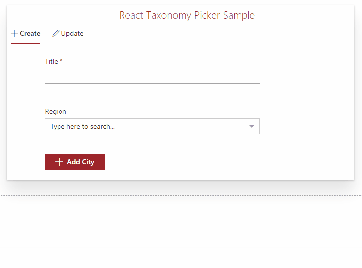
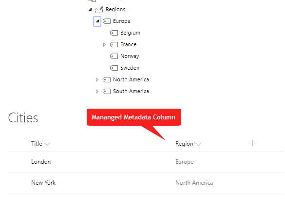

## SFPx React Taxonomypicker Sample

## Summary
A simple SPFx webpart that shows the usage of React Taxonomy Picker Control.

> Inspired from ([react-taxonomypicker](https://www.npmjs.com/package/react-taxonomypicker)) by ([José Quinto](https://github.com/jquintozamora))

## Demo

## Structure

## Used SharePoint Framework Version 

## Description

This webpart shows how to use the react-taxonomy picker to create and update a list item which has a managed metadata field. To use this sample
- Clone the repo
- Create a list called "Cities" with Title and Region (Managed metadata column)
- Map the Region column to a term set
- Update the ID and Name of that term set in the code

## Features
This extension illustrates the following concepts:
- Using **React** for building SharePoint Framework client-side solutions.
- Using **Office UI Fabric React** styles for building user experience consistent with SharePoint and Office.
- Adapting **Office UI Fabric styles**
- Theme syntax for applying official colors to custom CSS classes
